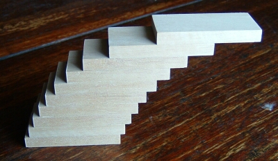

# The mathematics of the STACK logo

The STACK logo is based on the following problem.

> If you stack identical blocks one on top of the other, how far can it lean before it falls over?   You have a potentially unlimited supply of blocks.

The answer is that there is no limit to how far it can lean!  A physical model is shown below.

This model was made by Dr John Bryant.

## The mathematics of this problem

To see why the STACK of blocks doesn't fall over assume that the width of each domino is \(2\) "units".
Our strategy is this: at each stage we consider an existing balancing stack of \(n\) dominoes which has its centre of mass a distance \(c_n\) from its left-hand edge.

Obviously \(c_n\leq 2\) for all \(n\) as the centre of mass is to be above the bottom domino! We then place this stack on _top_ of a new domino a distance \(\delta_n\) from the left of the domino.
There will clearly be no toppling if

\[ \delta_n+c_n\leq 2.\]

That is to say we maintain balance if we don't displace the top stack so
far that the displacement plus the distance of the centre of mass from
the left pushes the centre of mass over the edge of the bottom domino -
which has width \(2\). The new centre of mass of the whole stack of \(n+1\)
dominoes will be \(c_{n+1}\) from the left of the bottom domino where

\[ c_{n+1} = \frac{(\delta_n+c_n)n+1}{n+1} \text{ with } c_1=1.\]

Using the first inequality the maximum displacement without toppling is
\(\delta_n=s-c_n\). Combining this with the formula for \(c_{n+1}\) and solving for
\(\delta_n\) gives

\[ \delta_{n+1} = 2-c_{n+1} = 2-\frac{(\delta_n+c_n)n+1}{n+1} = 2-\frac{(\delta_n+2-\delta_n)n+1}{n+1} = \frac{1}{n+1} \text{ with } \delta_1=1. \]

So that for all \(n\), \(\delta_n = \frac{1}{n}\).

## How big does the displacement become? ##

The question becomes, what is the value of

\[ 1 +\frac{1}{2} +\frac{1}{3} +\frac{1}{4} + \cdots +\frac{1}{N}= \sum_{n=1}^N \frac{1}{n} \]

for large N? If \(N\rightarrow \infty\), this is a particularly famous infinite series - the _harmonic series_.
Actually, this diverges. That is to say it is possible to make the sum as large as one would wish.
To see this, we group the terms as follows,

\[ \sum_{n=1}^N \frac{1}{n} = \left(1+\cdots+\frac{1}{9}\right) + \left(\frac{1}{10}+\cdots+\frac{1}{99}\right) + \left(\frac{1}{100}+\cdots+\frac{1}{999}\right) + \cdots \]

\[ \geq 9\frac{1}{10} + 90\frac{1}{100} + 900\frac{1}{1000} + \cdots \]

\[ = \frac{9}{10}+\frac{9}{10}+\frac{9}{10}+\cdots\]

which shows that the series keeps getting larger as we continue to add
terms. That is to say it does not converge.

In terms of the domino problem: we can choose displacements
\(\delta_n\) so that (i) the stack does not topple over, and (ii) we can produce an
arbitrarily large horizontal displacement. Bizarre indeed!

